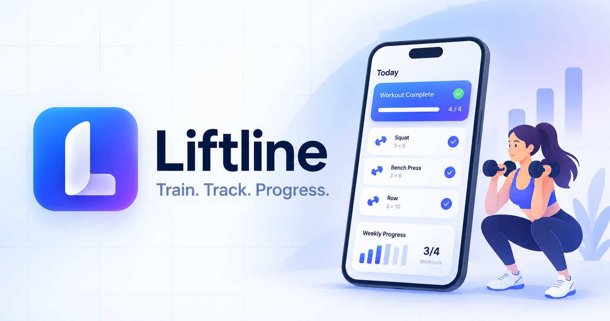

# Liftline

Liftline is a mobile-friendly workout tracker for a 12-week, three-day strength program. It turns the original spreadsheet routine into a clean, touch-first web app for logging weight, reps, RIR, notes, volume, and weekly progress.

Made with ChatGPT Codex



## Live app

The production app is hosted privately at [liftline-strength-plan.ktanzyl.chatgpt.site](https://liftline-strength-plan.ktanzyl.chatgpt.site). Access is restricted to the site owner.

## Features

- Complete 12-week plan with Day A, B, and C workouts
- Large mobile-friendly controls for entering weight, reps, and RIR
- Per-set completion tracking and exercise notes
- Automatic volume totals and next-session progression guidance
- Weekly session progress, workout history, and progress charts
- Day-by-day exercise history carousel with dates, sets, RIR, and notes
- Routine guide with targets, rest periods, muscle groups, and alternatives
- Persistent workout data backed by Cloudflare D1
- Review-first import from and automatic mirroring to the original Google Sheet layout
- Previous-session recall beside each exercise, including the logged date, weights, reps, and RIR
- Fast installed-app startup with a cached interface and immediate device-local display of the latest synced workouts
- Responsive Material-inspired interface using Geist typography

## Technology

- React 19 and TypeScript
- vinext and Vite
- Tailwind CSS and shadcn components
- Recharts for progress visualizations
- Drizzle ORM with Cloudflare D1/SQLite
- OpenAI Sites hosting on Cloudflare Workers

## Run locally

Requirements: Node.js 22.13 or newer and npm.

```bash
npm install
npm run dev
```

Open [http://localhost:3000](http://localhost:3000). The local development environment uses the configured `DB` D1 binding and applies the generated migrations.

## Useful commands

```bash
npm run dev          # Start the development server
npm run build        # Create a production build
npm run start        # Run the built Worker locally with Wrangler
npm run lint         # Run oxlint
npm run format       # Format the project with oxfmt
npm run db:generate  # Generate a Drizzle migration after schema changes
```

## Project structure

```text
app/
  api/workouts/route.ts  Workout history API
  api/workouts/sync-sheet/route.ts  Full Google Sheet backfill endpoint
  api/workouts/import-sheet/route.ts  Protected Google Sheet import preview and apply endpoint
  workout-app.tsx        Main responsive application interface
db/schema.ts             Drizzle schema
drizzle/                 Generated SQLite migrations
lib/routine.ts           12-week routine and exercise definitions
public/                   Liftline icons and sharing artwork
```

## Data behavior

Workout entries are keyed by week, day, and exercise. Saving an exercise creates or updates that entry, so a session can be resumed without duplicating records. The dashboard derives completion, session totals, training volume, and progression suggestions from the saved entries.

The initial Week 1 example entries mirror the source spreadsheet so the progress experience is visible immediately. New and updated entries are stored persistently in D1.

## Google Sheet sync

Liftline can exchange completed entries with the existing `Workout Log` layout. Each normal save updates its matching Week/Day/Exercise row, and the Progress screen includes a **Send to Google Sheet** button for backfilling all completed Liftline entries.

The separate **Import from Google Sheet** action always shows a preview first. New rows are selected automatically. When the same Week/Day/Exercise already exists in Liftline with different values, it is protected and stays unselected unless the owner explicitly chooses to replace it. The server reads the Sheet again when the import is confirmed, so a record created in Liftline after the preview is also protected.

The linked workbook is currently an Excel `.xlsm` file in Google Drive. Google requires an Office file to be converted before Apps Script can be attached. Use **File → Save as Google Sheets**; Google creates a separate native copy and leaves the `.xlsm` original unchanged.

1. Open the native Google Sheet copy and choose **Extensions → Apps Script**.
2. Paste `integrations/google-apps-script/Code.gs` into the script editor.
3. Replace `replace-with-a-long-random-token` with a long random token.
4. Choose **Deploy → New deployment → Web app**, run it as yourself, and allow anyone to invoke it. The token is still required for every write.
5. Configure the private Liftline Site with these production secrets and deploy again:

   - `GOOGLE_SHEETS_WEBHOOK_URL`: the Apps Script `/exec` URL
   - `GOOGLE_SHEETS_SYNC_TOKEN`: the same random token

The Apps Script reads completed rows and only writes Date, set weights/reps, RIR, Notes, and Logged status. It identifies rows by Week, Day, and Exercise number, preserving the workbook's existing formulas and formatting.
