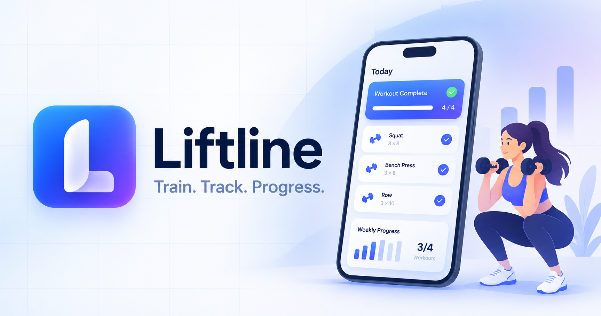

# Liftline

Liftline is a mobile-friendly workout tracker for two progressive 12-week, three-day strength phases. It turns the original spreadsheet routine and its specialized follow-up programme into a clean, touch-first web app for logging weight, reps, RIR, notes, volume, and weekly progress.

Made with ChatGPT Codex



## Live app

The production app is hosted privately at [liftline-strength-plan.ktanzyl.chatgpt.site](https://liftline-strength-plan.ktanzyl.chatgpt.site). Access is restricted to the site owner.

Current production version: **v3.13.3**

The experimental [bundled iOS foundation](docs/native-ios.md) is included in the repository, but is not ready for personal logging: native devices display a setup guard until the storage/connection choice and real-device tests are complete. The private web app keeps its existing storage and functionality, with faster cached startup. See the [release rollback notes](docs/rollback.md) for the pre-release backup.

## Features

- Two complete 12-week plans with Day A, B, and C workouts
- Locked Phase 2 transition after all 36 Phase 1 sessions are complete
- Specialized Phase 2 programming with chest/quad, back/posterior-chain, and shoulders/arms emphasis
- Phase-specific progress, workout history, guidance, and rotating training tips
- Large mobile-friendly controls for entering weight, reps, and RIR
- Per-exercise set controls supporting one to five saved sets
- Exercise-aware rest timer with pause, resume, reset, and completion vibration where supported
- Automatic rest-timer start when a set is marked complete, with optional background notifications
- Switching exercises resets the previous rest timer; reopening the same exercise preserves an intentional rest
- Per-set completion tracking and exercise notes
- Device-local draft recovery for unfinished main-plan and Holiday inputs, including notes, RIR, and set counts
- Optional persistent Workout focus view for quick access to exercise logging without the dashboard
- Accurate day completion indicators that distinguish partial exercise progress from a finished session
- Automatic volume totals and next-session progression guidance
- Personal-record detection for weight, reps, volume, and estimated strength
- Weekly session progress plus selectable per-exercise progress charts
- End-of-session summaries with volume, set count, duration, comparisons, and personal records
- Responsive day-by-day exercise history carousel and grid with dates, sets, RIR, and notes
- Automatically rotating training tips covering form, progression, rest, and recovery
- Routine guide with targets, rest periods, muscle groups, and alternatives
- Persistent workout data backed by Cloudflare D1
- Offline-safe workout logging with automatic retry when the connection returns
- Visible device-save and Google Sheet sync status with manual retry controls
- Review-first import from and automatic mirroring to the original Google Sheet layout
- Fast database-first saves with Google Sheet mirroring completed in the background
- Previous-session recall beside each exercise, including the logged date, weights, reps, RIR, and saved note
- Optional one-tap copying of previous-session weights and reps
- Fresh weight and rep inputs for each new week, without copying the previous workout into the new record
- Session-only exercise substitution, reordering, skipping, and custom exercise additions
- Downloadable JSON backups with preview-first, non-destructive restore
- Fast installed-app startup with a cached interface and immediate device-local display of the latest synced workouts
- Verified Today JavaScript/CSS caching, retained prior offline interfaces during interrupted updates, and optional persistent device-cache retention
- Device-only startup timing and cache/storage checks under Progress → Data → Startup details
- In-app animated movement guides with exercise-specific form cues and alternate movement choices
- A mobile-friendly nutrition guide with daily targets, meal templates, practical restaurant choices, and progress rules
- A separate tropical-themed Holiday mode with alternating A/B bodyweight sessions, rep-or-time logging, optional travel-equipment loads, exercise history, animated movement guides, and completion recaps
- A dedicated `Holiday Log` Google Sheet tab that keeps travel training separate from the 12-week programme
- Responsive Material-inspired interface using Geist typography

## Version history

Minor fixes, visual refinements, and deployment maintenance are grouped into the nearest feature release so this history focuses on meaningful product changes.

### v3.13 — Calmer, clearer workout UI

- In v3.13.2, verify the production Today dependency graph before replacing the offline interface, retain two prior shell/asset pairs, request optional persistent storage after logger readiness, and defer Progress/session-summary personal-record scans until shown. Add on-demand Startup details, interrupted-update regressions and production-web repeat-launch checks. No database, authentication, icon or Capacitor changes.
- In v3.13.1, return the installed web app's cached interface immediately while refreshing in the background, without caching sign-in redirects or APIs. Include a guarded bundled Capacitor iOS foundation and isolated repeat-launch regression tools; native workout logging remains unavailable until storage and device validation are complete.
- Compact the Today spotlight and mobile metric cards so logging is reached sooner, while keeping every overview value and the existing persistent Workout focus control.
- Reduce secondary-card shadows and remove hover elevation from passive statistics; retain emphasis for the workout card, weekly progress and primary actions.
- Label the programme dropdown “Menu” so Nutrition, schedule and guide are easier to discover; phase selection remains inside.
- Increase important dates, set-history details and instructions to 14px. Use a distinct regular-weight slate-gray numeric placeholder with at least 4.5:1 contrast on the tested light input surfaces.
- Share Day A/B/C badge styling across Today, Plan and Progress: blue, emerald and violet. Completion indicators remain green.
- Delay the fixed-width Today sidebar until 1024px so tablet-sized workout columns do not squeeze the numeric controls.
- Group Google Sheet exchange and backup/restore under Progress’s accessible Data menu. Keep existing callbacks, phase restrictions, busy-state protection and per-day PDF buttons unchanged.
- Add navigation, day identity, Data-menu action and placeholder-contrast regressions; retain the existing offline, draft, save, timer and PDF coverage. App icons and artwork revision v9 are unchanged.

### v3.12 — Day reports and clearer rest alerts

- In v3.12.1, give the Day A/B/C history badges larger, non-shrinking circles with balanced padding around their labels.
- In v3.12.2, centre compact mobile set rows with matching number/status circles and consistent gaps to the weight/reps controls, while retaining the wider side-by-side layout on larger screens.
- In v3.12.3, move Nutrition into the programme dropdown, keep Today/Plan/Progress as the primary tabs, and remove Readiness check, Warm-up & plates and Body metrics from that menu without deleting stored records.
- Download a consolidated PDF from each Day A/B/C card in Progress. Reports cover every saved phase/week, volume charts, per-exercise first/latest trends, full sets, RIR and notes. Partial and device-pending records are labelled; unsaved drafts and Holiday logs are excluded. Original Unicode records are also attached to the PDF.
- Generate reports locally with PDF/font libraries loaded only on download. Noto fonts support Latin and Japanese notes; the larger Japanese font is fetched only when required and fonts can be cached after first use. Fonts are licensed under the SIL Open Font License (see `public/fonts/`).
- Keep one rest-timer engine active across view navigation; send permitted system notifications in foreground as well as background, expose delivery errors, and add test alerts, optional sound and screen wake lock.
- iOS can suspend a browser when the phone is locked. These local alerts are not server-scheduled Web Push and cannot guarantee a locked-screen or Apple Watch alarm. Use the native iPhone/Watch timer for that case. Web Push and Watch mirroring require additional server scheduling infrastructure and device notification settings.
- Retain the v3.11.1 simplified weight controls and light-gray RIR placeholder, and all v9 icon artwork.

### v3.11 — Safer sync and lighter workout entry

- Store each offline revision independently, acknowledge only uploaded revisions, and serialize queue runners across tabs where Web Locks is available. Retry temporary failures with bounded backoff while the app is open; keep permanent conflicts for review instead of retrying them endlessly.
- Use indexed, server-generated revision cursors for main and Holiday delta refreshes. Late offline uploads and Google Sheet status changes are visible regardless of the device clock.
- Include Holiday records in version-3 backups while retaining version-2 restore compatibility. Block a misleading “complete” export when offline records are pending, and explain that device-only drafts are excluded.
- Reject negative/non-finite loads, non-positive/fractional reps or seconds, invalid set counts, and invalid RIR in new saves. Previous-session recall starts with uncompleted set checkboxes; historical backup records are preserved.
- Keep the rest timer deadline across navigation/reload, with best-effort service-worker notifications where supported. iOS can suspend browser execution; notifications are not a guaranteed background alarm.
- Isolate the live input state from the dashboard, persist only the edited draft payload, and load the entire Progress view on demand.
- Cache Holiday history on the device, refresh by revision, and load earlier sessions in pages. Add Holiday offline saves, previous notes/RIR/copying, and the shared rest timer.
- Add a conditional Undo last save action. Undo refuses to overwrite a newer server record and is offered for confirmed online saves only. The weight-step selector was removed in v3.11.1; weight buttons use 2.5 kg steps.
- Add actual route/migration regression tests alongside the existing draft, completion, and installed-startup checks. Keep all current v9 app icons unchanged.

### v3.10 — Recoverable drafts and focused workouts

- Recover unfinished exercise inputs when navigating between exercises or reopening the app, with separate main-plan and Holiday drafts and clear device-save status.
- Resume the most recently edited draft in the earliest unfinished main-plan day; never jump past an untouched week.
- Add an optional Workout focus view that hides dashboard artwork, metrics, and side panels while retaining exercise controls, rest timer, movement guides, and day navigation. The preference stays on the device.
- Show partial exercise counts on day tabs, with a checkmark only when every non-skipped exercise is complete.
- Bound installed-app network-first startup to one second when an offline shell exists, while refreshing in the background. Explicit version URLs remain network-first, and sign-in routes are never served from the workout-shell cache.
- Make cached workout logs, programme dates, and recovered drafts immediately usable while the server refresh runs in the background, without changing the selected exercise mid-session.
- Keep local drafts separate from saved workout records. Drafts expire after 30 days, are capped at 32 exercises, and are removed after a successful save or accepted main-plan offline queue submission.

### v3.9 — Holiday movement guides

- Added an on-demand animated movement guide to every Holiday mode exercise, matching the guide experience in the main training plan.
- Included travel-aware form cues and alternate demonstrations for combined movements such as backpack/band rows, push-up variations, and front/side planks.
- Kept the guide code and animations out of the initial Holiday screen bundle until the guide is opened.

### v3.8 — Leaner charts and smoother workout logging

- Keep startup on the earliest incomplete programme week through today's scheduled week, including weeks with no logged exercises, so Liftline never skips an untouched week.
- Replaced the general-purpose charting library with accessible native SVG progress charts, removing the largest optional JavaScript dependency while preserving weekly volume, top-weight, and estimated-max views.
- Isolated the rest timer into its own component so each one-second countdown update no longer rerenders the full workout dashboard.
- Moved backup restore and Google Sheet import dialogs into an on-demand chunk that loads only when either tool is opened.
- Added memoized workout indexes for active records, previous sessions, phase history, session summaries, and exercise progress so repeated render-time searches no longer rescan the full training log.

### v3.7 — Performance and startup stability

- Centered the numeric entry boxes between their minus and plus controls so the desktop Weight and Reps columns read as balanced units.
- Centered the desktop set-table headings over their Set, Weight, Reps, and Status columns for precise horizontal alignment.
- Centered the stacked mobile Weight/Reps control block between the set-number and completion circles for even horizontal spacing.
- Aligned the set-number and completion circles to the numeric input row for a cleaner, consistent horizontal rhythm.
- Balanced narrow-screen set entry by placing compact Weight and Reps controls side by side when space allows, while retaining a stacked phone fallback.
- Refined narrow-screen set entry with compact number fields, clearer placeholder values, vertically centred completion controls, and tidier previous-session wrapping.
- Resume the most recent started-but-unfinished training week before moving to the current calendar week.
- Added iPhone 17 safe-area handling for the Dynamic Island, rounded display edges, and home indicator in browser and installed-app layouts.
- Increased frequently used mobile controls to a 44-point touch target and reorganized set entry into comfortable stacked weight and rep controls on narrow screens.
- Raised native select sizing to prevent iOS focus zoom and improved small dashboard-label legibility.
- Softened the decorative progress-card ring so it stays behind the training controls without visually cutting through them.
- Reduced the offline shell from dozens of obsolete icon generations to the current install assets and critical Today artwork, so updates install with far less cache work.
- Re-encoded the workout illustrations as right-sized WebP assets and prioritized the above-the-fold Today illustration for faster painting.
- Restored cached workout data and the first unfinished day before paint to reduce startup movement while preserving calendar-aware navigation.
- Reduced rest-timer wakeups from four per second to one per second without changing the visible countdown.
- Deferred older workout-history rows until “Earlier weeks” is expanded, keeping the Progress screen's initial DOM much smaller.
- Split Plan, Nutrition, and Training Guide into on-demand chunks, alongside the existing lazy-loaded charts, movement guides, programme tools, advanced insights, Holiday mode, and dialogs.
- Removed superseded icon and manifest generations from the production package while retaining the verified v9 favicon and iOS/PWA install chain.

### v3.6 — Liftline monogram icon

- Recreated the selected minimal monogram as an edge-to-edge cobalt-to-violet app icon with a softly folded white and lavender L.
- Added matching in-app, notification, favicon, multi-size Apple touch, Chrome/Android, and maskable assets.
- Preserved credential-aware manifest loading for the private Site, plus the root Apple icon fallback, so both Safari and Chrome on iOS can retrieve the updated artwork.
- Increased the week picker's padding, control height, and spacing between its label, dropdown, and date for a calmer mobile layout.
- Simplified the header status to a green online or red offline dot beside the save state, removing the redundant connectivity label.
- Refreshed the repository banner with the current Liftline monogram, redesigned workout dashboard, and matching training illustration.

### v3.5 — Lift Path identity (21 September 2026)

- Replaced the previous glossy icon with the selected Lift Path concept: one clean, rising L-shaped silhouette designed to remain recognizable at favicon size.
- Standardized the in-app header mark, browser favicon, rest-timer notification icon, Apple touch icons, and Chrome/Android install icons around the same blue-to-violet identity.
- Added separate rounded browser artwork and full-bleed mask-safe home-screen artwork so the mark keeps balanced spacing without nested frames, white gutters, or doubled corner treatments.
- Versioned the install manifest and offline icon cache so newly added home-screen shortcuts receive the refreshed artwork instead of a stale saved icon.
- Made the private install manifest credential-aware so iOS Chrome can retrieve the real Lift Path artwork instead of generating a fallback letter tile.
- Centralized the app version, artwork revision, Apple touch icon, and install icons in one release registry. Every production build now verifies the icon files and dimensions and blocks publishing if the protected manifest loses its credential setting.

### v3.4 — Liftline visual redesign (20 September 2026)

- Promoted the tested beta redesign to the main Liftline app while retaining all existing workout records and integrations.
- Reworked the visual system around deep navy typography, airy white surfaces, blue-to-violet gradients, larger corner radii, and soft layered shadows inspired by the supplied mobile fitness reference.
- Added a compact three-ring training overview for weekly sessions, logged volume, and overall phase completion.
- Added lightweight, minimal exercise illustrations to the Today and Plan views, using transparent artwork and lazy loading to retain the beta's responsive feel.
- Increased the week selector's arrow spacing for clearer desktop and mobile interaction.
- Added saved notes to the previous-session card so exercise-specific context from the last completed week is visible while training.
- Refreshed the in-app brand mark, browser favicon, iOS home-screen icon, Chrome/Android install icons, maskable icon, and notification icon with the new glossy blue-violet Liftline design.
- Cropped the supplied icon artwork to its coloured boundary so it fills each app-icon container without the original white outer margin.
- Rebuilt the icon as fully opaque, edge-to-edge artwork with dedicated Apple touch sizes and a root `apple-touch-icon.png` fallback for reliable iOS and Chrome home-screen installation.
- Restored the original glossy Liftline mark in the app header and applied the same artwork to dedicated transparent-corner favicon assets.
- Rebuilt the Chrome/PWA and Apple home-screen icon chain with versioned, full-bleed 192 px, 512 px, maskable, and device-specific touch assets to prevent stale or missing install icons.
- Refined the brand header, week picker, workout surfaces, desktop side rail, and mobile navigation while retaining all existing training, history, timer, nutrition, Holiday mode, and Google Sheet tools.

### v3.3 — Holiday training mode (14 September 2026)

- Added a compact palm-tree Holiday control beside the phase menu without crowding the main navigation.
- Added two alternating 25–35 minute travel sessions based on the holiday maintenance guide, covering legs, pushing, pulling, shoulders, posterior chain, and core.
- Added a distinct teal, turquoise, and warm-sand visual theme so Holiday mode is immediately recognizable while retaining Liftline's interaction patterns.
- Added one-to-five-set logging with optional load, reps or timed seconds, RIR, notes, previous-session recall, and recent holiday history.
- Added a holiday-session completion recap plus guidance for recovery days and activity-heavy trips.
- Kept all Holiday mode records in a separate D1 table so Phase 1 and Phase 2 history, progress, and unlock state remain untouched.
- Added a separate `Holiday Log` tab and connector action for holiday records in the workout Google Sheet.

### v3.2 — Training tools and programme insights (8 September 2026)

- Added editable Phase 1 and Phase 2 start dates so weekly schedule labels can follow real training dates without changing recorded history.
- Added a quick readiness check using sleep, energy, soreness, and joint comfort, with conservative train-as-planned, modified-session, or recovery-day guidance.
- Added working-weight warm-up suggestions and a per-side plate calculator.
- Added persistent weight, waist, body-fat, and lean-mass tracking with manual, Withings, InBody, and CSV source labels plus CSV import.
- Added a compact, collapsed programme-insights panel for strength trends, muscle-group set distribution, hard-effort signals, and possible recovery concerns.
- Extended JSON backups to include programme dates, body measurements, and readiness checks while retaining compatibility with earlier backups.
- Added a clear workout-complete celebration and session recap when the final exercise of a day is logged.
- Made the completion recap continue automatically to the next training day, or to Day A of the next week after Day C.
- Simplified the mobile session editor to a compact settings icon while retaining its full label on larger screens.
- Stabilized the consolidated Phase menu, kept active-phase selections on the current week, and removed a notification-button hydration error that could show an error page.
- Kept the session editor and previous/next exercise controls on one compact row on mobile.
- Made exercise navigation circular so moving past the final exercise returns to the first, and moving back from the first returns to the final exercise.
- Made startup calendar-aware so Liftline opens on the programme week containing today and selects its first unfinished training day instead of resetting to Week 1 or retaining an old day.

### v3.1 — Faster startup and quieter navigation (8 September 2026)

- Made the installed app reopen from its cached interface immediately, then refresh safely in the background.
- Added incremental workout refreshes and a database index so returning visits transfer and query only records that changed.
- Deferred movement-guide code and media until a guide is opened, reducing the main workout bundle by roughly one third.
- Consolidated programme progress, phase selection, and the training guide into a compact header menu.
- Replaced the large connection-status panel with a concise online and saved indicator in the header.

### v3.0 — Phase 2 progression (7 September 2026)

- Added a compact phase selector that unlocks Phase 2 after all 36 Phase 1 sessions are complete.
- Added a second 12-week specialized full-body programme with chest/quad, back/posterior-chain, and shoulders/arms training days based on the Phase 2 guide.
- Kept Phase 1 and Phase 2 workout records, charts, history, personal records, session edits, tips, and guidance separate while preserving all existing data.
- Added Phase 2 double-progression, free-weight transition, fatigue, deload, and cardio guidance.
- Kept the legacy Google Sheet exchange scoped to Phase 1 because its original layout does not contain Phase 2 rows.

### v2.3 — Scannable exercise history (7 September 2026)

- Grouped each exercise’s records into expandable weekly categories.
- Alternated week colours so adjacent records are easier to distinguish.
- Kept the latest three weeks expanded while placing older records inside a collapsed Earlier weeks group.

### v2.2 — Nutrition guide (7 September 2026)

- Added Nutrition as a fourth primary destination on mobile and desktop.
- Adapted the personal dietary guide into quick daily targets, breakfast and two-meal templates, protein guidance, restaurant choices, progress checks, and example days.
- Used collapsible, responsive sections so the full guide remains easy to scan on a phone.

### v2.1 — In-app movement guides (7 September 2026)

- Replaced external YouTube searches with an in-app animated exercise demonstration modal.
- Added movement choices for combined exercises, such as Bulgarian split squats and hack squats.
- Added concise form cues, mobile-friendly scrolling, source attribution, and connection-error handling.

### v2.0 series — Offline-ready training and deeper insights (6 September 2026)

- Made workout logging instant and offline-safe, with automatic retry and clear device/Google Sheet sync status.
- Added personal-record detection, per-exercise progress charts, and detailed end-of-session summaries.
- Added one-tap previous-session values, automatic rest timing, and optional completion alerts.
- Made individual sessions flexible with exercise reordering, substitutions, skipping, custom exercises, and one-to-five-set controls.
- Added downloadable backups with preview-first, non-destructive restore.
- Improved installed-app reliability and cold-start speed so updates no longer leave an outdated, non-interactive screen.
- Unified the Liftline diagonal dumbbell icon and blue-to-indigo gradient across the app, added a softer rounded favicon, and refreshed the Safari and Chrome/PWA install assets.

### v1.5 — Workout history and flexible session tools (3–4 September 2026)

- Added previous-session dates, weights, reps, and RIR beside each active exercise.
- Added the responsive exercise-history grid, weekly volume overview, and rotating training tips.
- Added the rest timer and the ability to add or remove exercise sets.
- Ensured each new week opens with empty inputs while earlier workouts remain available for reference.
- Improved save responsiveness and corrected Google Sheet dates to use Liftline's Asia/Tokyo calendar day.

### v1.4 — Google Sheet exchange (2 September 2026)

- Added background sending from Liftline to the existing Google Sheet workout log.
- Added a separate import flow with a full preview and protection against overwriting newer Liftline records.

### v1.1 — Installable app and public demo (1–2 September 2026)

- Added home-screen installation, standalone display mode, and mobile icon support.
- Split the owner-only workout tracker from a read-only public sample.
- Added exercise video-search links and the first installed-app startup improvements.

### v1.0 — Initial release (1 September 2026)

- Converted the 12-week, three-day spreadsheet routine into a responsive React workout tracker.
- Added weight, rep, RIR, notes, completion, weekly progress, and D1-backed persistence.

## Technology

- React 19 and TypeScript
- vinext and Vite
- Tailwind CSS and shadcn components
- Accessible native SVG progress visualizations
- Drizzle ORM with Cloudflare D1/SQLite
- OpenAI Sites hosting on Cloudflare Workers

## Run locally

Requirements: Node.js 22.13 or newer and npm.

```bash
npm install
npm run dev
```

Open [http://localhost:3000](http://localhost:3000). The local development environment uses the configured `DB` D1 binding and applies the generated migrations.

## Useful commands

```bash
npm run dev          # Start the development server
npm run build        # Create a production build
npm run start        # Run the built Worker locally with Wrangler
npm run lint         # Run oxlint
npm run format       # Format the project with oxfmt
npm run db:generate  # Generate a Drizzle migration after schema changes
npm run test:workout # Run draft, queue, API, migration, backup, undo and startup checks
```

## Release workflow

New fixes and features are developed on `codex/` branches, tested, typechecked, built, and reviewed before promotion to `main`. Sites publication uses the tested source and matching production archive while preserving owner-only access.

## Project structure

```text
app/
  api/workouts/route.ts  Workout history API
  api/workouts/sync-sheet/route.ts  Full Google Sheet backfill endpoint
  api/workouts/import-sheet/route.ts  Protected Google Sheet import preview and apply endpoint
  api/workouts/backup/route.ts  JSON backup and preview-first restore endpoint
  api/workouts/program/route.ts  Session-only programme customization endpoint
  api/settings/route.ts  Programme schedule settings
  api/readiness/route.ts  Recovery readiness records and guidance
  api/body-metrics/route.ts  Body measurements and CSV-import storage
  api/holiday-workouts/route.ts  Separate Holiday mode workout history API
  workout-app.tsx        Main responsive application interface
  holiday-workout.tsx    Holiday A/B workout logger and history
db/schema.ts             Drizzle schema
drizzle/                 Generated SQLite migrations
lib/routine.ts           Phase 1 and Phase 2 routine definitions
lib/exercise-demos.ts    Animated movement-guide mapping and form cues
public/                   Liftline icons and sharing artwork
```

## Exercise demonstrations

Exercise GIFs are loaded only when a movement guide is opened. They are provided by the MIT-licensed [Exercise Library](https://github.com/mohamedatef90/exercise-library), which is credited inside each guide. Liftline keeps the exercise-specific cue text locally and sends no workout data to the media host.

## Data behavior

Workout entries are keyed by internal programme week, day, and exercise. Phase 1 uses internal weeks 1–12 and Phase 2 uses 13–24 while each phase displays its own Week 1–12 sequence. Saving an exercise creates or updates that entry, so a session can be resumed without duplicating records. The dashboard derives completion, session totals, training volume, and progression suggestions from the saved entries.

Phase 2 remains locked until all three sessions in every Phase 1 week are complete. Unlocking it never resets or replaces Phase 1 data; the phase selector can be used to revisit the original history at any time.

If a main-plan or Holiday workout is saved without a connection, Liftline keeps an immutable device queue and shows the workout immediately. The latest revision of each queued exercise is sent to D1 when the app is open and connected. Temporary failures retry with backoff; validation errors and newer-record conflicts are preserved for review. Acknowledging an earlier upload never removes a later queued edit. Do not clear browser storage until pending records have synced.

Server revision numbers, rather than client timestamps, identify changes for incremental refresh. Google Sheet status updates also advance the revision. Client save timestamps remain the conflict ordering rule; the server refuses stale saves instead of silently dropping local input.

JSON backups include main-plan records, Holiday records, session customizations, programme settings, readiness checks, and body metrics. Pending device uploads must sync before export. Unsaved device drafts are not part of the server backup. Restore remains preview-first and compatible with older backups that have no Holiday section.

Each exercise can store between one and five sets. Removing a set clears that row from the saved record; adding it again starts with an empty row.

Holiday mode uses its own persistent `holiday_workout_entries` table. Each trip session receives a unique session ID, so any number of Holiday A/B sessions can be recorded without consuming a programme week or changing the current Phase 1/2 workout. Timed core movements store seconds in the same per-set value field used for repetitions and are labelled by metric in the interface and Sheet.

The initial Week 1 example entries mirror the source spreadsheet so the progress experience is visible immediately. New and updated entries are stored persistently in D1.

Session customizations are stored separately by week and day. Reordering, substituting, skipping, or adding an exercise changes only that selected session; the original 12-week routine remains available as the reset state.

## Google Sheet sync

Liftline can exchange completed Phase 1 entries with the existing `Workout Log` layout. Each normal Phase 1 save updates its matching Week/Day/Exercise row, and the Phase 1 Progress screen includes a **Send to Google Sheet** button for backfilling completed Liftline entries. Phase 2 stays in Liftline and its downloadable backups because the original Sheet has no Phase 2 rows. Holiday mode writes to the separate `Holiday Log` tab by session ID and exercise number.

Normal saves return as soon as Liftline's database has stored the workout, while Google Sheet mirroring continues in the background. Because the existing sheet layout contains three set pairs, sets 4–5 remain stored and visible in Liftline while the first three sets are mirrored to Google Sheets.

Custom exercises have no matching row in the original spreadsheet, so they remain fully tracked in Liftline and its JSON backups but are intentionally excluded from Google Sheet sends.

The separate **Import from Google Sheet** action always shows a preview first. New rows are selected automatically. When the same Week/Day/Exercise already exists in Liftline with different values, it is protected and stays unselected unless the owner explicitly chooses to replace it. The server reads the Sheet again when the import is confirmed, so a record created in Liftline after the preview is also protected.

The linked workbook is currently an Excel `.xlsm` file in Google Drive. Google requires an Office file to be converted before Apps Script can be attached. Use **File → Save as Google Sheets**; Google creates a separate native copy and leaves the `.xlsm` original unchanged.

1. Open the native Google Sheet copy and choose **Extensions → Apps Script**.
2. Paste `integrations/google-apps-script/Code.gs` into the script editor.
3. Replace `replace-with-a-long-random-token` with a long random token.
4. Choose **Deploy → New deployment → Web app**, run it as yourself, and allow anyone to invoke it. The token is still required for every write.
5. Configure the private Liftline Site with these production secrets and deploy again:

   - `GOOGLE_SHEETS_WEBHOOK_URL`: the Apps Script `/exec` URL
   - `GOOGLE_SHEETS_SYNC_TOKEN`: the same random token

The Apps Script reads completed programme rows and only writes Date, set weights/reps, RIR, Notes, and Logged status. It identifies programme rows by Week, Day, and Exercise number. Holiday entries are appended or updated in `Holiday Log` using Session ID and Exercise number, including their reps-or-seconds metric and optional loads. After updating an existing Apps Script deployment for v3.3, create a new deployment version so the `writeHoliday` action becomes available at the existing `/exec` URL.

Workout dates use Liftline's Asia/Tokyo calendar day rather than the Google Sheet's timezone. This prevents an evening workout recorded on September 4 in Liftline from appearing as September 3 in a Sheet configured for a western timezone.
